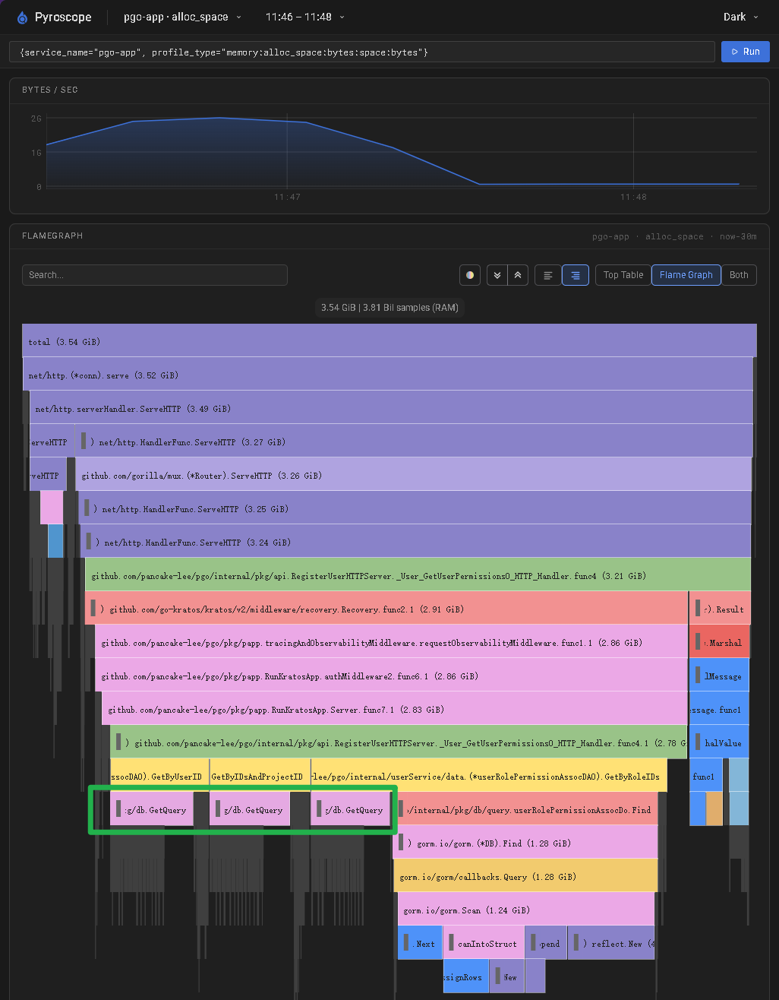
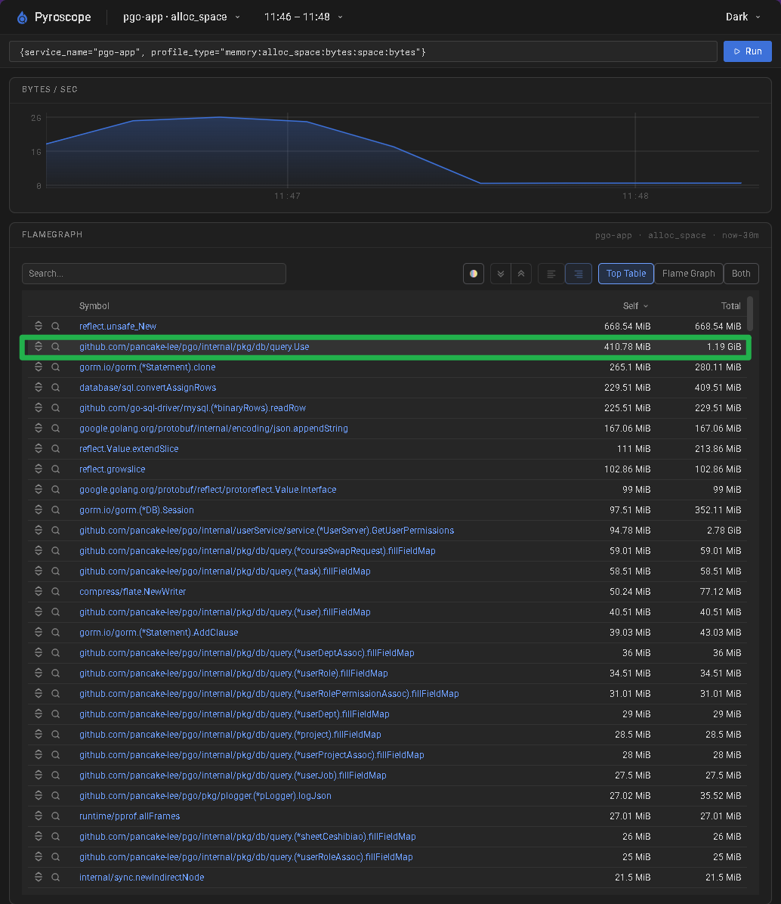
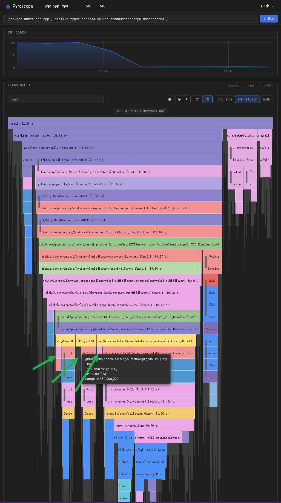
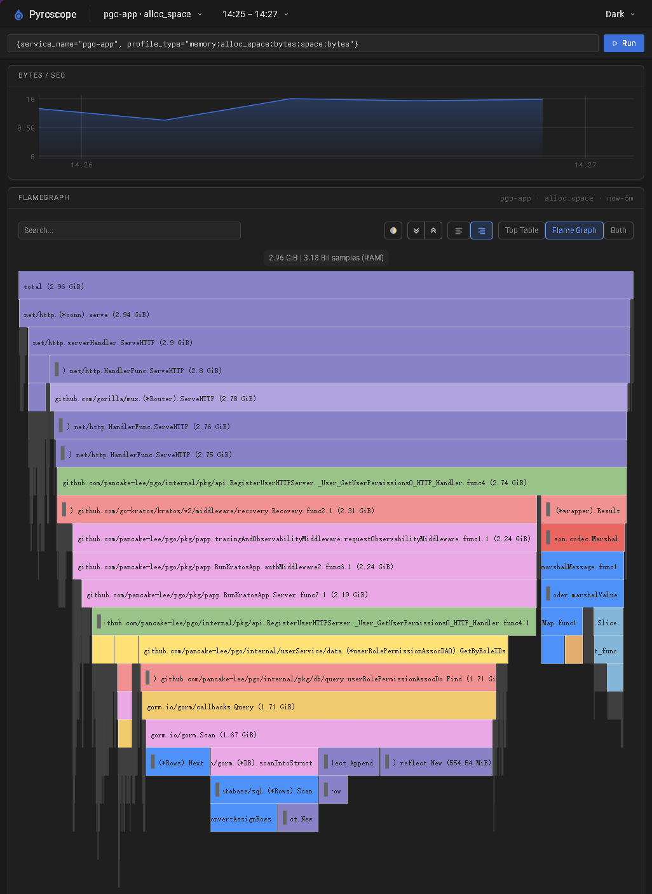
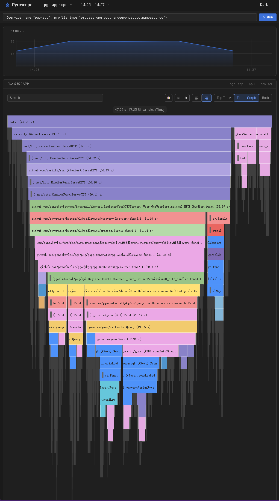

# 权限压测复盘：索引与 Query 对象复用

> 专题入口：[性能测试闭环中枢](../../../design/2026-09-30-01-login-performance-hub.md)。整理记录见[任务 75](../../../backlog.md#75-汇总-query-优化理解与自动压测对照)。

这次压测主要做了两次改动：

- **第一次，加索引**：执行计划中，权限关联表 `type=ALL`、`key=NULL`，估计扫描 38473 行，定位到缺少 `role_id` 索引。补上索引后，同样 50 RPS 下，两组读取从约 93% 成功恢复到全部成功，P95 从约 1 秒降到约 9ms。
- **第二次，减少重复对象构造**：Pyroscope 显示 GetQuery/Use 累计占 CPU 约 6.9%、内存分配约 34.5%。复用生成的 Query 后，auto 模式最高已测零错误档位从 210 提高到 250 RPS；同样 250 RPS 下，读取失败从 454 次降到零。截图确认 GetQuery 的消耗被大幅减少到可以忽略不计。

## 各轮目的与结果

- **[round-01](round-01/)**：建立成功负载窗口，两组延迟接近，未显示热点角色写入造成明显额外影响。
- **[round-02](round-02/)**：提高负载复现超时，数据库等待和执行计划将问题收敛到缺失索引。
- **[round-03](round-03/)**：加索引后按相同参数复测，读取恢复全部成功，读写延迟明显下降。
- **[round-04](round-04/)**：提高有索引 JOIN 的负载，保留最高已测成功档位，作为查询方案对照。
- **[round-05](round-05/)**：改为各表独立查询后程序聚合，延迟高于 JOIN，画像定位到重复构造 Query 的成本。
- **[round-06](round-06/)**：优化前重新使用 auto 模式测试，作为同参数对照组。
- **[round-07](round-07/)**：优化后使用相同 auto 参数测试，成功负载档位达到 JOIN 已测水平，构造热点明显减少。

下表读取失败为两组合计，延迟仅列热点组 P95，单位 ms。各轮正式负载均为 60 秒并开启采样；对照组及写入细节见各轮报告。06/07 另列同档负载，便于比较优化效果。

| round | 读 RPS | 读取失败 | 读取 P95 |
| --- | --- | --- | --- |
| 01 | 40 | 0/2400 | 154.938 |
| 02 | 50 | 216/3000 | 1002 |
| 03 | 50 | 0/3000 | 9.226 |
| 04 | 250 | 0/15000 | 73.685 |
| 05 | 200 | 0/12000 | 303.892 |
| 06 | 210 | 0/12600 | 54.501 |
| 07 | 210 | 0/12600 | 43.441 |
| 06 | 250 | 454/15000 | 937.688 |
| 07 | 250 | 0/15000 | 199.210 |

## 第一次优化：补上 role_id 索引

[执行计划](round-02/explain.txt)中，`user_role_assoc` 和 `user_role` 已使用索引，`user_role_permission_assoc` 却需要全表扫描。每个用户目标约为 5 个角色对应的 500 条权限关联，执行计划估计扫描约 4 万行。

同一 SQL 在无压力时独立执行约 27ms，但并发下重复扫描争抢资源，查询变慢，在途连接与协程增加，最后超过请求 deadline。单次耗时较短，不代表并发下的重复扫描成本低。

round-02 的执行计划与 round-03 的同参数复测相互印证，支持缺少 `role_id` 索引是原负载下的主要瓶颈。索引后的执行计划未归档，实际扫描行数不作推断。其他监控细节见 [round-02](round-02/) 和 [round-03](round-03/)。

## 第二次优化：复用 Query，减少重复构造

round-05 中，独立查询的延迟明显高于 JOIN。HostMonitor 未显示全核、内存或磁盘持续满载，但已有调度排队和连接池等待。我对这部分的理解是，硬件还有平均余量，不代表请求没有等待，需要结合应用画像定位成本发生在哪一层。硬件证据及不同 CPU 面板的统计口径见 [监控分析](round-05/20-analysis.md)。

GetQuery 重复构造 Query 带来了明显的 CPU 与内存分配成本，其中内存分配尤其突出。

### 重复构造 Query，底层仍使用同一个连接池

旧方案在每个 DAO 方法中调用 `GetQuery()`，重复构造 GORM Gen 生成的 Query 和各表查询对象，但这些对象底层依然使用同样的连接池。具体来说，`GetQuery()` 每次调用 `query.Use(pdb.GetGormDB())`，重新初始化全部 13 个表的字段和字段映射。权限接口串行访问三个 DAO，这个构造过程会重复三次，连本次查询不用的课程、任务等表对象也一起构造。

`Use()` 负责构造查询对象，真正执行 SQL 时才从连接池取得连接。我理解这次优化的重点是复用这些生成对象：现在调用 `GetQuery()` 使用同一个基础 Query，底层连接池的逻辑没有区别。

优化后，默认 Query 在数据库初始化后绑定一次，请求通过 `WithContext(ctx)` 和自己的查询条件创建操作链。多个请求复用基础 Query，不表示它们共用一条数据库连接；同一个普通请求里的三次 SQL，也不保证取到同一条连接。这次调整减少的是查询对象构造成本，没有改变连接池的取连接机制。

### 事务 Query 绑定已有 DB，复用字段定义

当前代码 `transaction.go` 的 `Begin` 启动事务，使用的是 `gDB.Begin()`，得到一个受管理的新 DB 对象。管理表保存这个对象，返回给业务的是事务管理句柄；后面 `GetQueryTx` 通过 `GetGormDB` 会拿回同一个事务 DB，查询使用事务已经占用的连接。

这里通过 `ReplaceDB(txDB)` 为 Query 副本绑定这个 DB，不用再通过 `Use(txDB)` 从头生成全新的 Query 对象。底层代码会拷贝必要部分，复用字段定义和字段映射，再替换数据库会话。我的理解是，事务需要的是绑定到正确的 DB，而字段定义这些与具体事务无关的部分可以继续复用。

这个过程仍会创建 Query 副本和 GORM 会话对象，但不会把全局默认 Query 改成事务 Query，也不会再次开启事务或获取新连接。

### 实现与验证

优化方案采用 GORM Gen 官方提供的默认 Query：生成器启用 `WithDefaultQuery`，服务在数据库初始化后调用 `SetDefault`，原 DAO 保留 `GetQuery()` 调用方式，返回已绑定的 `query.Q`。事务入口从 `Use(txDB)` 改成 `query.Q.ReplaceDB(txDB)`，保留事务管理逻辑。实现入口见 [db.go](../../../../internal/pkg/db/db.go)，生成器见 [genGORM.go](../../../../cmd/pgo/tools/genGORM/genGORM.go)。

这与开源示例的方向一致：GORM Gen [官方 DAO 示例](https://gorm.io/gen/dao.html)展示启动时绑定默认 Query；[Coze Studio](https://github.com/coze-dev/coze-studio/blob/main/backend/bizpkg/config/modelmgr/modelmgr.go)也在模块初始化时调用 SetDefault。对于我当前只有一个默认数据库的项目，这条路径比较直接。

本地基准中，普通 `GetQuery()` 从每次约 38 KB、215 次分配降到零分配；事务 Query 降到约 15 KB、27 次分配。并发请求隔离与事务绑定通过竞态回归，完整验证记录见[任务 74](../../../backlog.md#74-复用-gorm-gen-query-消除重复构造)。

round-06/07 使用相同 auto 参数，优化后最高已测零错误档位提高约 19%，同档读写延迟也明显下降。具体搜索边界见 [06 搜索记录](round-06/00-auto-run.json)和 [07 搜索记录](round-07/00-auto-run.json)。这些是本次短窗口的实测结果，未测定长期稳定容量。

优化后，GetQuery 的消耗被大幅减少到可以忽略不计，与本地零分配基准和同档负载改善相互印证。

两轮截图的负载与统计窗口不同，不直接比较总量降幅。权限压测主要走普通 GetQuery，本轮负载收益也不能单独归因于 GetQueryTx 的事务副本优化。

### 优化后的独立查询与 JOIN 对照

优化后的独立查询，RPS 提升到和 JOIN 方案相同的已测成功档位，延迟仍有差距。我目前的看法是，不能再把优化前独立查询的全部性能差距都归因于三次 SQL 往返：Query 对象重复构造是一项被定位、被修正、也被对照实验印证的成本，剩余差距需要按优化后的画像继续分析。
