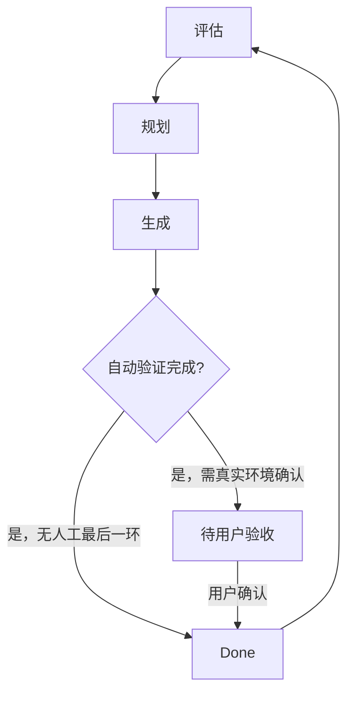

# PGO Harness Engineering — 架构概览

> Harness 是 PGO 的 AI 辅助开发协作体系。它把工作模式、文档交接、自动验证和中央规则同步组织为可重复的工程流程。

## 1. 工作流

- 工作模式由 `CLAUDE.md` / `AGENTS.md` 的触发词路由，完整流程见 `handbook/work-modes.md`。
- `docs/backlog.md` 是 Plan → Generate 和 Eval → Plan 的唯一交接载体；状态和表头遵循中央文档治理规范。
- 单一专题历经多轮循环且关联物分散时，在 `docs/design/` 建立 `*-hub.md` 串联。

## 2. 验证与可观测性

- 当前没有 photo-agent 那样独立的评估报告系统；评估以代码审阅、定向/全量 Go 测试、生成结果编译和 Makefile 验证为主，记录在 backlog 条目或版本归档。
- `pkg/plogger`、`pkg/papp/observability.go` 与 pprof/Prometheus 能力提供结构化日志、请求指标和诊断入口。具体实现以代码为准。
- 当生成器或基础库需要稳定量化指标时，再在 `docs/eval/` 建立基线与报告格式；在此之前不制造空的评估数据。

## 3. 中央同步

`CLAUDE.md`、`AGENTS.md` 和 `docs/handbook/` 的公共块由 pancake 的 `30-Tools/harness/common/` 通过 marker 同步。公共规则只能在 pancake 修改；项目特有的 Go 构建约束、文档索引和工具说明写在 marker 外。

标准文档集、命名、职责、backlog 格式与版本归档规则见 `pancake/30-Tools/harness/common/document-governance.md`。PGO 不使用 `docs/changelog.md`；版本历史写入 `docs/archive/vX.Y.Z.md`。

## 4. 文档索引

- [产品需求](prd.md)：PGO 做什么、服务谁、范围与质量目标。
- [技术方案](tech.md)：当前架构、生成链路、技术边界与构建契约。
- [Backlog](backlog.md)：活跃任务及跨模式交接。
- [技术备忘](note.md)：长期有效的备忘和明确否决记录。
- [手册](handbook/)：工作模式、评估、编码与文档审阅规范。
- [设计文档](design/) 与 [版本归档](archive/)：专题当前方案和已完成历史。
