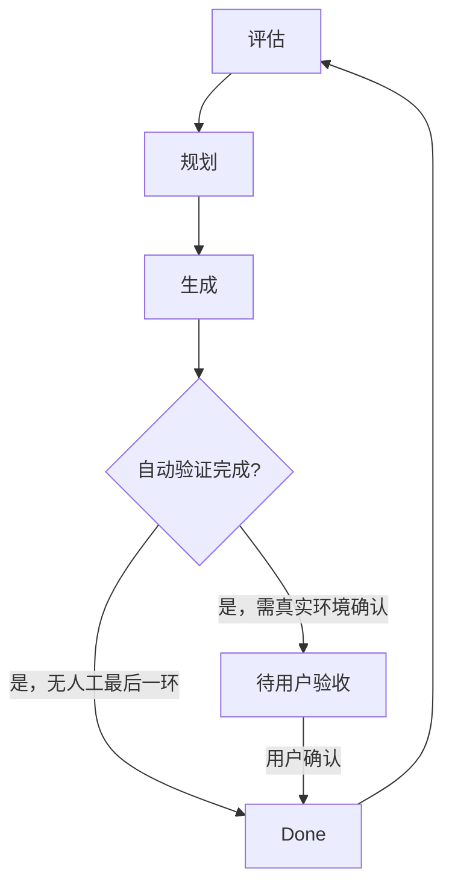

# PGO Harness Engineering — 架构概览

> Harness 是 PGO 的 AI 辅助开发协作体系。它把工作模式、文档交接和自动验证组织为可重复的工程流程。

## 1. 工作流

```mermaid
flowchart TD
    A[评估] --> B[规划]
    B --> C[生成]
    C --> D{自动验证完成?}
    D -->|是，无人工最后一环| E[Done]
    D -->|是，需真实环境确认| F[待用户验收]
    F -->|用户确认| E
    E --> A
```

- 工作模式由 `CLAUDE.md` / `AGENTS.md` 的触发词路由，完整流程见 `handbook/work-modes.md`。
- `docs/backlog.md` 是 Plan → Generate 和 Eval → Plan 的唯一交接载体；状态和表头遵循现行文档治理约定。
- 单一专题历经多轮循环且关联物分散时，在 `docs/design/` 建立 `*-hub.md` 串联。

## 2. 验证与可观测性

- **分阶段验证**：开发过程中只做基础静态校验和相关范围的编译检查；任务基本开发完成、标记 `Done` 前集中运行一次相关回归；数据竞争、全量测试等耗时检查按改动需要安排在任务收尾或版本归档前，归档前做一次更完整的验证。已通过的检查不随每次生成重复运行，具体节奏见 [工作模式手册](handbook/work-modes.md#验证节奏所有模式)。
- 当前没有 photo-agent 那样独立的评估报告系统；评估以代码审阅、定向/全量 Go 测试、生成结果编译和 Makefile 验证为主，记录在 backlog 条目或版本归档。
- `pkg/plogger`、`pkg/papp/observability.go`、`pkg/papp/pprof.go`、Prometheus、Loki、Alloy 与 Pyroscope 提供结构化日志、请求指标、持续 profiling 和限时诊断入口。具体实现以代码与部署配置为准。
- 当生成器或基础库需要稳定量化指标时，再在 `docs/eval/` 建立基线与报告格式；在此之前不制造空的评估数据。

## 3. 项目级编码约束

- **数据库查询优先使用生成接口**：已有 gentool 生成的表与字段时，优先使用 GORM Gen 的 `Join`、`Select`、`Where`、`Order` 和 `EqCol`；能够由生成接口表达的查询不手写 SQL 拼接。能力缺口才使用原生 SQL并说明限制，详见[编码规范](handbook/coding-conventions.md#数据库查询)。
- **最小化对外接口**：对外参数和可配置项必须对当前调用方有明确选择价值。只有一种合理取值或属于实现策略的内容收在模块内部，不为未被验证的未来需求扩大 API。
- **策略只有一个所有者**：默认值、生成规则、并发方式和超时边界等策略由实际执行它的模块管理，不在多层配置中重复定义或逐层透传。
- **测试取舍**：按风险选测试，验证稳定行为，不追求 100% 覆盖率。易变参数、简单赋值和实现细节通常不测；正常调整不应要求同步改断言。不能说明防范何种错误的测试不写。
- **测试服务于设计**：不为测试便利增加生产参数、分支、导出标识符或重复实现。
- **高内聚优先于工具函数**：与某个数据类型生命周期直接相关的校验、转换和持久化行为由该类型承担，并在代码中集中组织。只有真正无状态、无归属的行为才作为工具函数。
- **抽象覆盖完整边界**：对外部系统或第三方库的封装应拥有完整的边界责任，包括初始化、请求构造、调用和基础响应校验。底层实现细节保持私有，避免上层绕过抽象重复实现协议细节。
- **技术边界不承载业务意图**：基础设施和客户端方法按它们执行的技术操作命名，只保证技术边界内的正确性。业务目的、流程预期和跨调用结果判断由业务层表达。
- **通用机制与业务逻辑分离**：并发、重试、超时和调度等不含业务语义的机制统一放入基础层复用。业务层只提供输入和单次任务行为，不重复管理执行机制。
- **不同层级的结果分开表达**：批量、并发或编排流程中，单个任务结果与整体调度结果使用不同的返回通道。不使用伪造的普通结果表达不属于该层级的状态或错误。
- **同类问题使用同一模型**：同一模块或同一流程中，相同类型的校验、错误聚合、返回值和资源清理采用一致方式，避免相邻代码各自形成不同语义。
- **实现复杂度必须由需求支撑**：容错、持久化、恢复、兼容和扩展机制只在存在明确场景或已知风险时引入。不以“更稳健”或“以后可能需要”为由增加当前没有验收价值的复杂度。
- **声明必须有一句话注释**：手写代码中的每个结构体、接口等类型、函数、方法、包级变量和常量都必须有一句简短中文注释，包含未导出声明与 `init`；注释以声明名称开头，说明职责、用途或使用边界，不逐句复述实现。具体要求见 [编码规范](handbook/coding-conventions.md#注释)。
- **窄接口按能力命名**：只有一个核心行为的 Go 接口使用该行为的 `-er` 形式命名，实现类型也描述其承担的能力；仅当类型实际拥有完整领域生命周期时才使用宽泛的领域对象名。

## 4. 文档索引

- [产品需求](prd.md)：PGO 做什么、服务谁、范围与质量目标。
- [技术方案](tech.md)：当前架构、生成链路、技术边界与构建契约。
- [Backlog](backlog.md)：活跃任务及跨模式交接。
- [技术备忘](note.md)：长期有效的备忘和明确否决记录。
- [手册](handbook/)：工作模式、评估、编码与文档审阅规范。
- [设计文档](design/) 与 [版本归档](archive/)：专题当前方案和已完成历史。
