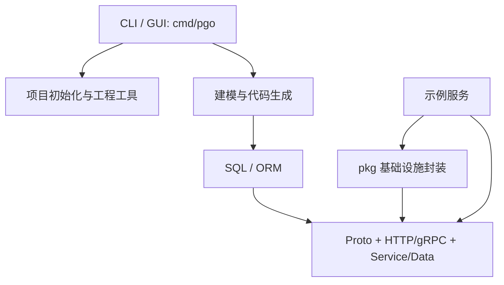

# PGO — 技术方案文档

## 1. 整体架构

PGO 由工具入口、代码生成链路、可复用基础库和示例服务组成。示例服务既是可运行能力，也是生成器与基础库的回归样本；不把它们误认为独立产品。

## 2. 职责边界

- `cmd/pgo/`：统一 CLI、交互式和 GUI 入口；承载项目初始化、表格转换、代码生成与部署辅助。
- `pkg/`：可复用技术封装，包括配置、日志、数据库、Redis、RabbitMQ、通用工具及第三方集成。
- `internal/`：具体服务实现和业务范例；服务间不应反向依赖 CLI。
- `proto/`：服务接口与错误契约；生成结果须与实现同步。
- `sql/`：可审阅的数据库 schema 和样例数据定义。
- `deploy/` 与 `configs/`：初始化、容器和运行配置模板；密钥仅存在于本地配置。

## 3. 代码生成与数据流

1. 使用 SQL 或 APITable 建立表结构；`sheet2mysql` 将表格模型导出为 SQL。
2. `make gorm` 从数据库/Schema 生成 ORM 模型。
3. `make curd`（保持现有命名）基于模型生成 Proto、HTTP/gRPC 桩、Service、Data 和入口接线。
4. 生成后由维护者补充业务规则、权限、跨表操作与集成验证；生成器不替代业务设计。

## 4. 技术选型

- Go 为主语言；构建和测试遵循 `GOTOOLCHAIN=local`。
- Kratos 承载服务端 HTTP/gRPC 分层与接口生成。
- GORM 负责 ORM 代码生成和数据访问；支持 MySQL 与 SQLite。
- Redis、RabbitMQ 通过 `pkg/` 封装集成；是否启用由具体服务配置决定。
- Prometheus/pprof 和结构化日志提供应用诊断与观测能力。

## 5. 接口与数据契约

- Proto 是服务 API 的契约来源；生成代码与 Proto 变更必须同轮审阅。
- SQL schema 是持久化模型的可审阅来源；表变更需说明兼容和迁移影响。
- 生成器的 CLI 参数、项目配置和输出目录构成生成契约；参数校验必须在写文件前完成。

## 6. 构建、验证与部署边界

- `make build`、`make cli`、`make cli-win` 产物统一输出到 `bin/`。
- `make gorm`、`make curd`、`make api`、`make api-cli` 负责生成链路；执行后必须审阅生成 diff。
- `make initDB` 初始化数据库。外部服务、真实凭据和部署环境属于本地/部署配置，不写入仓库。

## 7. 关键约束

- 不直接在仓库根目录输出 Go 二进制。
- 代码生成兼容性优先：未提供新配置时，既有项目的生成结果不得无故变化。
- 具体实现、字段与调用细节以代码和 Proto/SQL 为最终事实来源；本文件只维护稳定全景。
